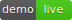
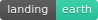
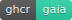
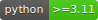
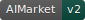
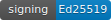

<!-- aicom-mirror-notice -->
> **📖 Read-only mirror.** `gaia` is published from the canonical AI-Factory monorepo.
> **Pull requests are not accepted** — any commit pushed here is overwritten by
> `scripts/mirror_satellites.sh` on the next sync.
> 🐞 Found a bug or have a request? Please **[open an issue](https://github.com/alexar76/gaia/issues)**.

# GAIA — physical-world oracle gateway

<!-- aicom-readme-badges -->
<p align="center">
  <a href="https://github.com/alexar76/gaia/actions/workflows/ci.yml"></a>
  <a href="https://github.com/alexar76/gaia/actions/workflows/pages.yml"></a>
  <a href="https://iot.modelmarket.dev/"></a>
  <a href="https://alexar76.github.io/gaia/"></a>
  <a href="https://github.com/alexar76/gaia/pkgs/container/gaia"></a>
  =3.11" />
  
  
  
  <a href="docs/badges/coverage.svg"></a>
  <a href="LICENSE"></a>
</p>
<!-- /aicom-readme-badges -->


**GAIA** is a physical-world oracle gateway that sells Ed25519-attested sensor readings from
virtual IoT devices as paid AIMarket v2 capabilities, and serves a Metis-envelope-compatible
`/v1/verify` so the hub's Pay-on-Verified escrow can settle them —
an honest reading gets the provider paid, a lying sensor refunds the buyer automatically.

It is the ecosystem's **third oracle class**: math oracles prove computations, Metis judges
LLM output, GAIA grounds settlement in physics. The demo fleet is simulated (two co-located
weather stations sharing one site truth, an air-quality node, an energy meter — models imitate
BME280/SDS011/SCD30/Shelly-EM-class hardware), but every wire surface — manifest, invoke,
receipts, provider signature, verify envelope, W3C WoT Thing Descriptions — is the real one.

<p align="center">
  <strong><a href="https://iot.modelmarket.dev/">Live demo</a></strong>
  ·
  <strong><a href="https://alexar76.github.io/gaia/">Landing</a></strong>
  ·
  <strong><a href="https://github.com/alexar76/gaia/pkgs/container/gaia">GHCR</a></strong>
</p>

> 📖 Deep-dive (monorepo): [`docs/iot-physical-oracles.md`](https://github.com/alexar76/aicom/blob/main/docs/iot-physical-oracles.md)
> 🌍 Live devices: [`gaia/devices/live.py`](gaia/devices/live.py)
> 🎬 3D visualization: [`frontend/`](frontend/) (`cd frontend && npm i && npm run dev`)

## Quickstart

```bash
# Container
docker pull ghcr.io/alexar76/gaia:latest
docker run --rm -p 9320:9320 ghcr.io/alexar76/gaia:latest

# From source (satellite checkout vendors oracle-core)
pip install -e vendor/oracle-core -e ".[dev]"   # or: pip install -e ../oracles/core -e ".[dev]"
python -m gaia.main                             # :9320
```

Poke it:

```bash
curl -s localhost:9320/.well-known/ai-market.json
curl -s localhost:9320/ai-market/v2/manifest

curl -s -X POST localhost:9320/ai-market/v2/invoke \
  -H 'Content-Type: application/json' \
  -d '{"capability_id": "gaia.weather.read@v1", "product_id": "gaia.gateway",
       "input": {"device_id": "ws-01"}}'
```

## Live devices — relay real public sensors

[`gaia/devices/live.py`](gaia/devices/live.py) wraps real public APIs (NOAA / OpenSenseMap /
OGC SensorThings) behind the same attestation + verifier path. Unreachable upstream → 503 →
no debit.

## License

MIT — see [LICENSE](LICENSE).
