# GAIA — 物理预言机网关

<!-- aicom-readme-badges -->
<p align="center">
  <a href="https://github.com/alexar76/gaia/actions/workflows/ci.yml"></a>
  <a href="https://iot.modelmarket.dev/"></a>
  <a href="https://alexar76.github.io/gaia/"></a>
  =3.11" />
  
  
  <a href="../LICENSE"></a>
</p>
<!-- /aicom-readme-badges -->

<p align="center">
  <a href="https://iot.modelmarket.dev/">
    
  </a>
</p>

> 🌐 [English](../README.md) · [Русский](README.ru.md) · [Español](README.es.md) · [Français](README.fr.md) · **中文** · [术语表](https://github.com/alexar76/aicom/blob/main/docs/localization-glossary.md)

**GAIA** 是**物理预言机**网关：把虚拟 IoT 设备上经 Ed25519 **证明（attestation）** 的传感器
**读数**作为 AIMarket v2 付费 capability 出售，并提供与 Metis envelope 兼容的 `/v1/verify`，
以便 Hub 通过 **Pay-on-Verified（验证后付款）** **托管（escrow）** 完成**结算** —
诚实读数支付给**提供方**，说谎传感器自动退款给买方。

它是生态的**第三类预言机**：数学预言机证明计算，Metis 评判 LLM 输出，GAIA 把结算锚定在物理世界。
演示**机队**是仿真的（两座共址气象站共享同一 site truth、空气质量节点、电表 — 模型仿
BME280/SDS011/SCD30/Shelly-EM），但每条线面 — 清单、**调用（invoke）**、**收据**、提供方签名、
verify envelope、W3C WoT Thing Descriptions — 都是真实协议面。

<p align="center">
  <strong><a href="https://iot.modelmarket.dev/">在线演示</a></strong>
  ·
  <strong><a href="https://alexar76.github.io/gaia/">落地页</a></strong>
  ·
  <strong><a href="https://github.com/alexar76/gaia/pkgs/container/gaia">GHCR</a></strong>
</p>

> 📖 深读（单体仓）：[`docs/iot-physical-oracles.md`](https://github.com/alexar76/aicom/blob/main/docs/iot-physical-oracles.md)
> 🌍 在线设备：[`gaia/devices/live.py`](../gaia/devices/live.py)
> 🎬 3D：[`frontend/`](../frontend/) (`cd frontend && npm i && npm run dev`)

## 快速开始

```bash
docker pull ghcr.io/alexar76/gaia:latest
docker run --rm -p 9320:9320 ghcr.io/alexar76/gaia:latest

pip install -e vendor/oracle-core -e ".[dev]"
python -m gaia.main                             # :9320
```

探测：

```bash
curl -s localhost:9320/.well-known/ai-market.json
curl -s localhost:9320/ai-market/v2/manifest

curl -s -X POST localhost:9320/ai-market/v2/invoke \
  -H 'Content-Type: application/json' \
  -d '{"capability_id": "gaia.weather.read@v1", "product_id": "gaia.gateway",
       "input": {"device_id": "ws-01"}}'
```

## 在线设备 — 公共传感器中继

设置 `GAIA_ENABLE_LIVE=1` 可在仿真器旁注册真实公共 API **中继（relay）**。
每个中继走同一套 Ed25519 证明与**合理性（plausibility）**路径。上游不可达 →
`DeviceOffline` → 503 / `{ok:false}` → **不扣款**。上游主机在 **allowlist** 中（防 SSRF）；
invoke 客户端**永不**提供 URL。

| Device id | Capability | Upstream | 密钥？ |
|-----------|------------|----------|------|
| `nws-01` | `gaia.weather.read@v1` | NOAA/NWS `api.weather.gov` | 否 |
| `om-wx-01` | `gaia.weather.read@v1` | [Open-Meteo](https://open-meteo.com) weather | 否 |
| `osm-01` | `gaia.air.read@v1` | openSenseMap | 否 |
| `om-aq-01` | `gaia.air.read@v1` | Open-Meteo air quality | 否 |
| `sta-01` | `gaia.air.read@v1` | OGC SensorThings (Fraunhofer) | 否 |
| `openaq-01` | `gaia.air.read@v1` | OpenAQ v3 | **是** (`GAIA_OPENAQ_API_KEY`) |
| `uk-grid-01` | `gaia.grid.read@v1` | UK Carbon Intensity | 否 |
| `usgs-quake-01` | `gaia.quake.read@v1` | USGS GeoJSON feed | 否 |
| `noaa-tide-01` | `gaia.tide.read@v1` | NOAA CO-OPS tides | 否 |
| `firms-fire-01` | `gaia.fire.read@v1` | NASA FIRMS VIIRS (cite NASA) | 否 |
| `safecast-01` | `gaia.radiation.read@v1` | Safecast (CC0) | 否 |
| `cybernews-jam-01` | `gaia.jamming.read@v1` | CyberNews GNSS (CC BY 4.0) | 否 |
| `feeder-adsb-01` | `gaia.adsb.read@v1` | Own dump1090 ingest | `GAIA_FEEDER_*` |
| `feeder-ais-01` | `gaia.ais.read@v1` | Own AIS ingest | `GAIA_FEEDER_*` |

运维说明（5 种语言）：[`docs/LIVE-RELAYS.md`](LIVE-RELAYS.md)。
添加传感器 / 标记（GAIA → ATLAS）：[`add-gaia-atlas-sensor`](https://github.com/alexar76/aicom/blob/main/docs/add-gaia-atlas-sensor.md)（EN · RU · ES · FR · ZH）。

```bash
curl -s -X POST https://iot.modelmarket.dev/ai-market/v2/invoke \
  -H 'Content-Type: application/json' \
  -d '{"capability_id":"gaia.grid.read@v1","product_id":"gaia.gateway",
       "input":{"device_id":"uk-grid-01"}}'
```

## 许可

MIT — 见 [LICENSE](../LICENSE)。
